<div align="center">
  </div>
<br/>

<!--  ABOUT  -->
### 👩‍💻 About Me

```java
public class Rebeca {

  String name        = "Rebeca Ayres";
  String role        = "Full-Stack Developer";
  String location    = "São Paulo, Brazil 🇧🇷";
  boolean openToWork = true;

  String[] stack = {
    "Java", "Spring Boot",
    "Python", "Oracle", "Docker"
  };

  String greet() {
    return "Let's build! 🚀";
  }
}
```

<br/>

---

<!--  STATS DASHBOARD  -->
### 📊 GitHub Stats
 
<div align="center">

  <table border="0" cellspacing="0" cellpadding="10">
    <tr>
      <td>
        
      </td>
      <td>
        
      </td>
    </tr>
  </table>

</div>

---

<!--  TECH STACK  -->
<table border="0" cellspacing="10" cellpadding="10" width="100%">
<tr>

<td valign="top" width="33%" style="padding: 8 16px 0 0;">


### Frontend  
<a href="https://github.com/beccaaydev">
<div align="center">  
  
</div>
</a>

</td>
<td valign="top" width="33%">

### Languages  
<a href="https://github.com/beccaaydev">
<div align="center">  
  
</div>
</a>

</td>
<td valign="top" width="33%">

### Others  
<a href="https://github.com/beccaaydev">
<div align="center">  
  
</div>
</a>

</td>
</tr>
</table>

---

<!--  CONNECT  -->
### 📬 Let's Connect

<div align="center">

[](https://linkedin.com/in/rebeca-ayres)
[](https://instagram.com/thvbeccah)
[](mailto:rvitayres@email.com)

</div>

<br/>

---

<div align="center">
  
  <br/><br/>
  <sub> by Rebeca Ayres</sub>
</div>
